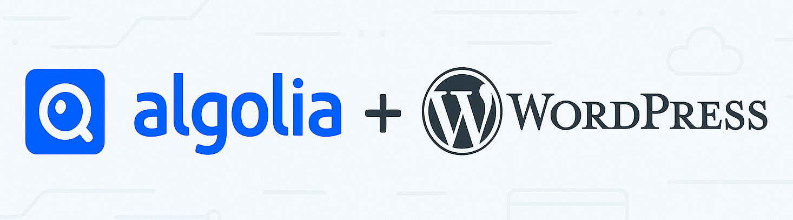

# Algolia Cleanup Tool for Wordpress

This tool cleans Algolia search results by removing unnecessary code generated by the Algolia WordPress plugin when it indexes a WordPress website. It streamlines search results by removing `<p>` tags and code brackets `[]` to ensure a better user experience.

**You are most welcome to use this code in your commercial projects, all that I ask in return is that you credit my work by providing a link back to this repository.**

Thank you & Enjoy!



# Features

- Downloads all records from the specified Algolia index.
- Cleans up `post_excerpt` and `content` fields by:
  - Stripping `<p>` tags.
  - Removing Divi shortcode blocks enclosed in `[]`.
- Updates cleaned records back to the Algolia index.

# Prerequisites

- Node.js v22
- npm 

# Setup

## Step 1: Install Dependencies

```bash
npm install
```

## Step 2: Configure Environment Variables

```
cp .env-sample .env
```
Insert credentials in `.env`:

```
ALGOLIA_APPLICATION_ID=<Your_Algolia_Application_ID>
ALGOLIA_API_KEY=<Your_Algolia_API_Key>
INDEX_NAME=<Your_Index_Name>
```

To obtain these credentials:

1. Log in to the Algolia dashboard.
2. Navigate to your application's API keys.
3. Copy the Application ID and API Key.
4. Find the name of the index you wish to clean.

## Step 3: Run the Tool
Execute the tool using the following command:

```bash
node run.mjs
```

The tool will perform the following tasks:
1. Retrieve all records from the specified Algolia index.
2. Clean up each record's `post_excerpt` and `content` fields as needed.
3. Update the cleaned records back to the Algolia index.
   

# Repository Files

## `run.mjs`
The main script file that:
- Connects to the Algolia API.
- Retrieves records from the specified index.
- Cleans up the records.
- Updates the cleaned records back to the index.

Key Functions:
- **browseIndex**: Downloads all records from the Algolia index.
- **stripDiviCode**: Removes Divi shortcode blocks.
- **removePTags**: Removes `<p>` tags.
- **containsPTags**: Checks if a string contains `<p>` tags.
- **containsCodeBrackets**: Checks for shortcode brackets.
- **updateRecords**: Updates records in the Algolia index.


# Troubleshooting

## Common Errors

### Missing or Invalid Credentials
**Error**: "Algolia Application ID or API Key not found."

**Solution**: Verify that the `.env` file exists and contains the correct credentials.

### Node.js Version Mismatch
**Error**: "Syntax error or unsupported ECMAScript features."

**Solution**: Ensure you are using Node.js v22. Run `nvm use 22` to switch to the correct version.

### API Rate Limits
**Error**: "Algolia API rate limit exceeded."

**Solution**: Check your Algolia plan's rate limits and adjust the tool's usage frequency if necessary.


